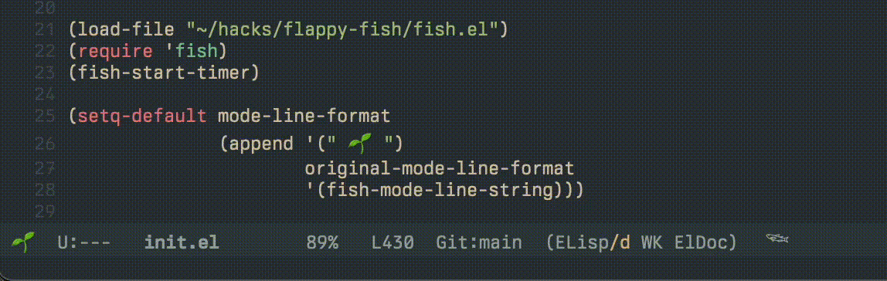

Flappy Fish for Emacs
===

<div align="center">
  
  <p style="font-size: small; color: #555; margin-top: 8px;">
    <em>"Even a fish wouldn't get into trouble if it kept its mouth shut." </em>
  </p>
</div>

<div align="center">

---

Flapping fish in your active buffer

## Features

- **Swimming Fish**: A fish that swims across your mode-line based on buffer position
- **Static Fish**: A flapping fish that stays in one place
- **Interactive**: Click on the mode-line to navigate to different positions in your buffer

## Installation

### Manual Installation

1. Download `fish.el` to your load path
2. Add to your init file:

```elisp
(require 'fish)
```

### MELPA (Coming Soon)

I'm going to do this... eventually

```elisp
(use-package fish
  :ensure t)
```

## Usage

### Method 1: Manual Integration with Your Mode-Line

If you want to add the fish to your custom mode-line format:

```elisp
(require 'fish)
(fish-start-timer) ;; or (fish-start-timer 'swimming)

(setq-default mode-line-format
              (cons fish-mode-line-string original-mode-line-format))
```

## Customization

### Change the Fish Animation Speed

```elisp
(setq fish-update-period 0.3) ;; Time between flaps (default 0.2 seconds)
```

### Change the Swimming Area Width

```elisp
(setq fish-bar-length 40) ;; Width of swimming area (default 32)
```

### Customize Appearance

```elisp
;; Add text/emoji before and after the fish
(setq fish-prefix "🌊 ")
(setq fish-suffix " 🐠")

;; Change background character in swimming area
(setq fish-wave-character "~")
```

### Change Fish Font

```elisp
(set-face-attribute 'fish-face nil :family "Your Font")
```

## Troubleshooting

If the fish isn't displaying correctly:

```elisp
(fish-reload)
```

## Requirements

- For best display, a font with Egyptian hieroglyphs (like Noto Sans Egyptian Hieroglyphs)


```elisp
(require 'fish)
(fish-start-timer 'static)
;; Set up mode-line-format to include fish-mode-line-string
(setq-default mode-line-format
            (list "%e" mode-line-front-space mode-line-mule-info
                  mode-line-client mode-line-modified mode-line-remote
                  mode-line-frame-identification mode-line-buffer-identification
                  "   " mode-line-position
                  '(vc-mode vc-mode)
                  "  " mode-line-modes
                  'fish-mode-line-string))
```

### 4. Customizing the fish appearance:
```elisp
(setq fish-prefix "🌊 ")    ;; Add a wave in front of the fishy
(setq fish-suffix " 🐠")    ;; Add another fishy
```

## Commands

- `M-x fish-start-timer` - Start the fish animation
- `M-x fish-stop` - Stop the fish animation

## Customization

- `fish-update-period` - Time in seconds between fish flaps
- `fish-bar-length` - Width of the 'water' in the mode line
- `fish-wave-character` - Character used for the background of the fish swimming area
- `fish-prefix` - Text to display before the fish in the mode-line
- `fish-suffix` - Text to display after the fish in the mode-line 
